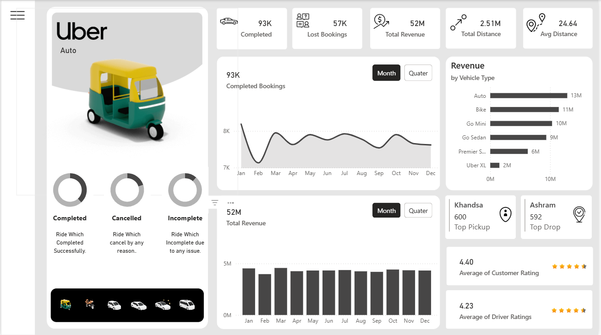

# Uber Data Analytics Dashboard (Power BI)

## Project Overview
This project showcases an **interactive Power BI dashboard** built to analyze Uber auto-rickshaw operations. It provides deep insights into ride activity, revenue generation, customer behavior, and operational efficiency.

The dashboard enables stakeholders to monitor performance trends, identify high-demand areas, and make data-driven business decisions.

---

## Objectives
- Analyze ride demand and booking trends over time  
- Identify peak usage periods and high-performing vehicle types  
- Evaluate operational efficiency through cancellations and lost bookings  
- Understand customer and driver satisfaction using rating metrics  
- Provide actionable insights for improving ride-sharing operations  

---

## Key Dashboard Metrics
- **Completed Bookings:** 93K  
- **Lost Bookings:** 57K  
- **Total Revenue:** 52M  
- **Total Distance:** 2.51M  
- **Avg Distance per Trip:** 24.64  
- **Customer Rating:** 4.40  
- **Driver Rating:** 4.23  

---

## Key Insights
- **Peak Demand Trends:** Ride demand fluctuates monthly with noticeable peaks during mid-year and festive periods  
- **Top Revenue Contributors:** Auto and Bike segments generate the highest revenue  
- **Geographic Patterns:** Khulna and Assam emerge as top pickup and drop locations  
- **Operational Gaps:** Significant number of lost bookings indicates potential service inefficiencies  
- **Customer Experience:** High average ratings reflect strong service quality  

---

## Dashboard Features
- **Interactive Filters (Slicers):** Date, vehicle type, and locations  
- **Dynamic Visualizations:** Line charts, bar charts, KPI cards  
- **Cross-filtering:** Clicking any visual updates the entire dashboard  
- **Drill-down Analysis:** Explore detailed insights from summary views  
- **Responsive Layout:** Optimized for clean and intuitive user experience  

---

## Tools & Technologies
- **Power BI Desktop** – Data visualization & dashboard creation  
- **Power Query** – Data cleaning and transformation (ETL)  
- **DAX (Data Analysis Expressions)** – Calculated measures and KPIs  
- **Microsoft Excel** – Data source  

---

## Technical Implementation

### Key DAX Measures
- Average_Distance = AVERAGE(uber[Ride Distance])
- Booking_Count = DISTINCTCOUNT(uber[Booking ID])
- Completed_Bookings = CALCULATE([Booking_Count], uber[Booking Status] = "Completed")
- Lost_Bookings = CALCULATE([Booking_Count], uber[Booking Status] <> "Completed")
- Total_Distance = SUM(uber[Ride Distance])
- Booking_Value = SUM(uber[Booking Value])

---

## Learning Outcomes
Through this project, I developed and strengthened the following skills:

- **Data Cleaning & Transformation:** Used Power Query to preprocess and structure raw Excel data  
- **Data Modeling:** Built relationships and optimized data structure within Power BI  
- **DAX Fundamentals:** Created calculated measures for KPIs such as bookings, revenue, and distance  
- **Data Visualization:** Designed a clean, user-friendly, and interactive dashboard  
- **Business Thinking:** Translated raw data into actionable insights for decision-making  
- **Dashboard Design:** Learned how to present data effectively using KPIs, charts, and filters  
- **Analytical Thinking:** Identified trends, patterns, and operational inefficiencies  

---

## Key Takeaway
This project helped me understand how to transform raw data into meaningful insights through interactive dashboards, which is a core skill in data analysis and business intelligence.
